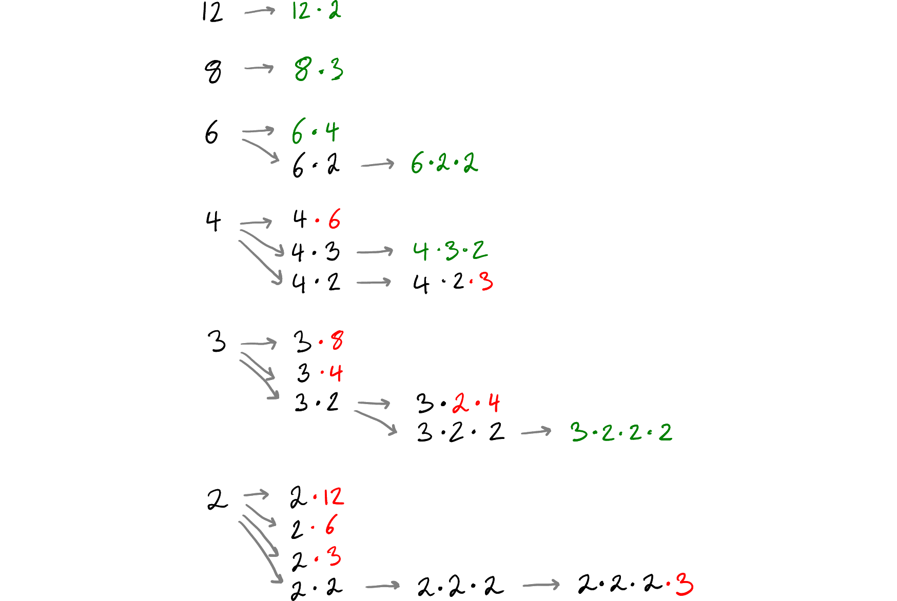

# Primes

This library contains functionality to work with primes and related concepts. Factorizing integers into their prime factors is another big thing.

## Computing primes

### Iterative method

If we don't have an upper bound for primes, we need to compute them as we go. The algorithm for that is very straightforward:

- Create an empty list that will hold the primes.
- Iterate through numbers from 2, these will be our candidate $c$.
    - Take all previous primes $p$:
        - When $c$ is divisible by $p$, $c$ cannot be a prime number and we proceed to the next candidate.
        - When we have reached $p$ such that $p^2 > c$, then $c$ doesn't have any divisors and must be prime.
    - Add the candidate to the list of primes.

As we're testing division by already known primes, we can proceed rather quickly. The $p^2 \lt c$ constraint makes it even faster.

If one needs to go through the primes a second time, one can reuse the list with primes. Only when that is exhausted, one needs to compute more of them.

### Sieve

If the ceiling is known, one can use the [Sieve of Eratosthenes](https://en.wikipedia.org/wiki/Sieve_of_Eratosthenes).

## Factorizations

Let us take $n = 24$, which we can factor into $2^3 \times 3$. Then we can build the following search tree by taking any remaining divisor within the current branch. We also enforce that the following divisors must not be greater than the preceding one to avoid duplicates.

This gives us the following search tree:

This can be traversed by using a recursive function.

Hence we have these factorizations:

- 24
- 12 × 2
- 8 × 3
- 6 × 4
- 6 × 2 × 2
- 4 × 3 × 2
- 3 × 2 × 2 × 2

We can see that there is a recurring tail in these factorizations. Here we have factorized 4 multiple times. Hence it makes sense to cache the results if one wants to factorize a lot of numbers.