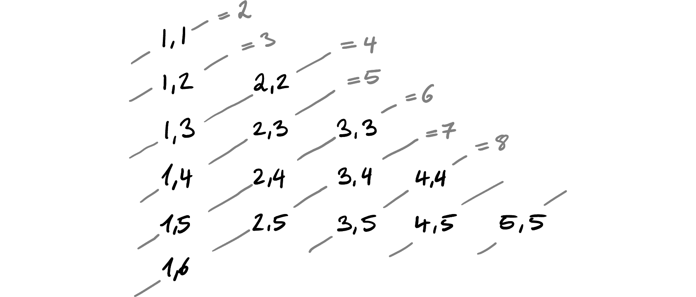
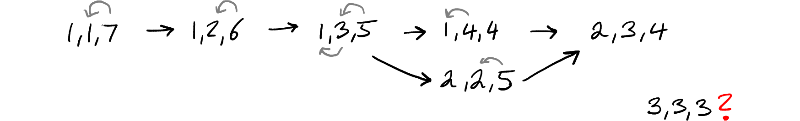

# Product-Sum Numbers (88)

In [Problem 88](https://projecteuler.net/problem=88), we're asked to find numbers that can be represented both as a sum and product of a sequence of numbers.

We can reframe the question with more math notation like so: For every $k \in \mathbb N$ with $2 \le k \le 12\,000$, find the positive integer sequence $(a_i)_{i=1}^k$ such that
$$ n_k := \prod_{i=1}^k a_i = \sum_{i=1}^k a_i $$
is minimized. The final solution then the sum of all unique $n_k$.

## Naive complexity

We have to iterate through 12,000 values of $k$. Then we have to iterate through $n_k$ until we find one where we can find a decomposition $(a_i)_i$ that fulfils the product-sum-relation. In order to find this decomposition, we need to iterate through all possible decompositions.

Even for fixed $k$ and a fixed candidate number, there are lots of factorizations that one could try out. Let us take 12. That can be decomposed as $2^2 \cdot 3$.

If we look at $k = 2$, then this can already be these configurations:

- 1 × 12
- 2 × 6
- 3 × 4

At $k = 3$, we have these:

- 1 × 1 × 12
- 1 × 2 × 6
- 1 × 3 × 4
- 2 × 2 × 3

We essentially have a triple loop here. That is not clever enough to solve this problem.

We have two ways to slice this problem:

1. We iterate over all $k$ and then try to find the matching $n_k$.
2. We iterate over all $n$ and see for which $k$ we can find a product-sum-match.

The way that the problem is phrased, it suggests to start with the first approach. As I found out the hard way, that doesn't work. Therefore we will cover the second approach first. You can read about the non-viability of the first approach further down.

## Fixing _n_ and looking for suitable _k_'s

We can also look at all factorizations without fixing $k$ beforehand. We use the [factorization function](../Library/primes.md#factorizations) from the library.

Iterating over all factorizations that have at least two factors, we can compare the product and the sum. In case that the sum is smaller than the product, we can always pad with ones on both sides. If the sum is larger than the product, it is not a viable factorization.

Taking 8, we can factorize that into 2 × 4. But 2 + 4 is just 6, so we need to pad it with 1's:
$$ 1 \times 1 \times 2 \times 4 = 1 + 1 + 2 + 4 \,. $$

Assuming that we have already checked all smaller $n$ and haven't found a solution for $k = 4$ yet, we know that $n_4 = 8$.

Similarly we do the factorization into 2 × 2 × 2 and realize that this also only yields 6. Hence we add more 1's again:
$$ 1 \times 1 \times 2 \times 2 \times 2 = 1 + 1 + 2 + 2 + 2 \,. $$

This gives us $n_5 = 8$.

The algorithm that we can generalize from this approach is:

- Iterate over all $n$ from 2 to infinity …
    - Iterate over all factorizations $(f_i)_{i=1}^m$ of $n$ …
        - If the factorization has only one element, $m=1$, skip that one.
        - Compute the sum over all factors, $s := \sum_{i=1}^m f_i$. We know by construction that $n = \prod_{i=1}^m f_i$.
        - If $s < n$, we need to pad with $n - s$ many elements of 1. That increases $s$ exactly such that it is $n$, and $n$ will be unchanged.
        - The number of elements in the decomposition is $k := m + (n - s)$.
        - If $k \leq 12\,000$, note the $n$ as the smallest $n_k$ possible for that $k$ because we have checked all smaller $n$ already.
    - If we have 11\,999 elements in our result, we have found an $n_k$ for every $k$ and break out of the loop.
- Take the unique $n_k$ and sum them up.

My Rust implementation runs in 123 ms.

## Trying to use a fixed _k_

Let us now explore why using a fixed $k$ leads us astray. Looking at $k = 2$, we can organize the two numbers in a grid and see that the sum of the two numbers stays the same on diagonal lines:

We can then look at the products that we can form in these positions. The strong number now means the product, the lines indicate the sum. When both match, we have a candidate. We're looking for the match that is on the highest diagonal, meaning the smallest number.

From this, one can see that within each diagonal, the numbers get bigger. As this is monotonic, we should be able to bisect along the diagonal line and reduce the complexity from $\mathcal O(k)$ to $\mathcal O(\log n)$.

All this is just $k = 2$, though. When we go to $k = 3$, we get another dimension along which we can slice. A two-dimensional representation isn't sufficient any more, we get this two dimensional grid with all possible combinations:

We don't need to keep all from one ring though, just the lexicographically smallest one is sufficient. And it seems that these can be represented in a pyramid of sorts, until the sum is 9 and the number of combinations grows faster. When the tuples are sorted lexicographically, their product seems to increase, as before.

These are cute drawings, but I am not sure whether any of this really helps.

### Moving digits

Another idea that I had is that I could just decrease a number on the right and increase a number on the left. The constraint is that the numbers must not decrease from left to right in order to avoid duplicates. For $k = 3$ and a total of 9, we start with $(1, 1, 7)$ and then can form all the other ones by this technique:

In order to reach (3, 3, 3), handling only adjacent numbers is not enough. We also need to move non-adjacent numbers. That makes the graph more complicated:

Because only working with adjacent numbers, the idea turns out to be more complicated.

### Search tree

We can formulate this as a search tree, though. We pick all possible first numbers and then see which second numbers are viable and so on. This is the graph that get:

Using recursion, one could easily traverse all these options. At least for $k = 3$, the monotonicity is still there and one could think about exploiting it.

I have done this and written a recursive function that will decompose the remainder further into a sum. The return value is a set of all possible products that can be formed given the desired sum $n$ and the number of elements $k$.

From $k = 23$, it becomes crawling. I tried to look into caching, but unfortunately each subtree is unique and we cannot reuse the parts. So that idea is a dead end.