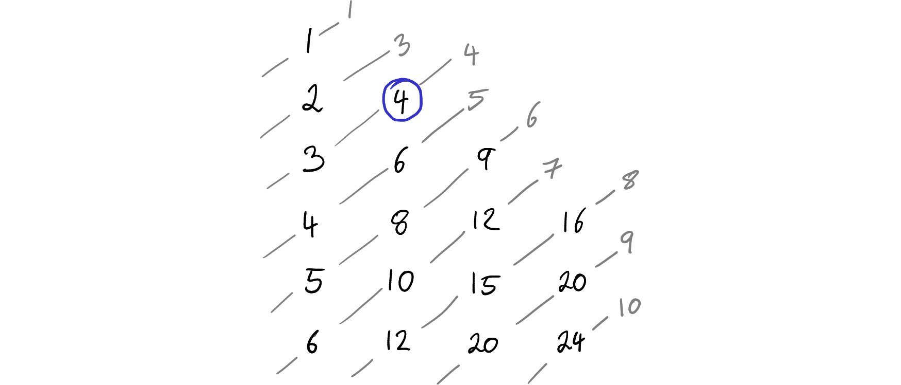
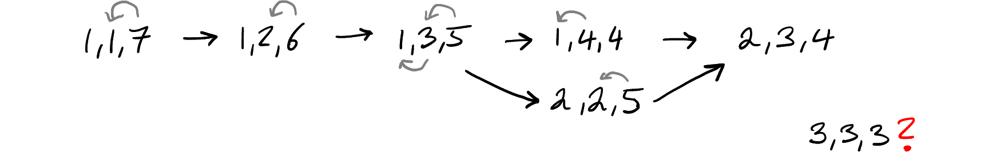
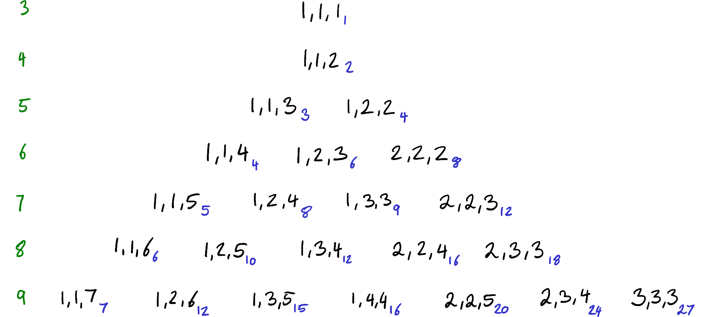

# Product-Sum Numbers (88)

In [Problem 88](https://projecteuler.net/problem=88), we're asked to find numbers that can be represented both as a sum and product of a sequence of numbers.

We can reframe the question with more math notation like so: For every $k \in \mathbb N$ with $2 \le k \le 12\,000$, find the positive integer sequence $(a_i)_{i=1}^k$ such that
$$ n_k := \prod_{i=1}^k a_i = \sum_{i=1}^k a_i $$
is minimized. The final solution then is $\sum_{k=2}^{12\,000} n_k$.

## Naive complexity

We have to iterate through 12,000 values of $k$. Then we have to iterate through $n_k$ until we find one where we can find a decomposition $(a_i)_i$ that fulfils the product-sum-relation. In order to find this decomposition, we need to iterate through all possible decompositions.

Even for fixed $k$ and a fixed candidate number, there are lots of factorizations that one could try out. Let us take 12. That can be decomposed as $2^2 \cdot 3$.

If we look at $k = 2$, then this can already be these configurations:

- 1 × 12
- 2 × 6
- 3 × 4

At $k = 3$, we have these:

- 1 × 1 × 12
- 1 × 2 × 6
- 1 × 3 × 4
- 2 × 2 × 3

We essentially have a triple loop here. That is not clever enough to solve this problem.

## Trying to organize the decompositions for fixed _k_

My first approach is to chose a fixed $k$ and then organize all the $k$-tuples that I can form with that many numbers.

### Organizing into grids

Looking at $k = 2$, we can organize the two numbers in a grid and see that the sum of the two numbers stays the same on diagonal lines:

We can then look at the products that we can form in these positions. The strong number now means the product, the lines indicate the sum. When both match, we have a candidate. We're looking for the match that is on the highest diagonal, meaning the smallest number.

From this, one can see that within each diagonal, the numbers get bigger. As this is monotonic, we should be able to bisect along the diagonal line and reduce the complexity from $\mathcal O(k)$ to $\mathcal O(\log n)$.

All this is just $k = 2$, though. When we go to $k = 3$, we get another dimension along which we can slice. A two-dimensional representation isn't sufficient any more, we get this two dimensional grid with all possible combinations:

We don't need to keep all from one ring though, just the lexicographically smallest one is sufficient. And it seems that these can be represented in a pyramid of sorts, until the sum is 9 and the number of combinations grows faster. When the tuples are sorted lexicographically, their product seems to increase, as before.

These are cute drawings, but I am not sure whether any of this really helps.

### Moving digits

Another idea that I had is that I could just decrease a number on the right and increase a number on the left. The constraint is that the numbers must not decrease from left to right in order to avoid duplicates. For $k = 3$ and a total of 9, we start with $(1, 1, 7)$ and then can form all the other ones by this technique:

In order to reach (3, 3, 3), handling only adjacent numbers is not enough. We also need to move non-adjacent numbers. That makes the graph more complicated:

Because only working with adjacent numbers, the idea turns out to be more complicated.

### Search tree

We can formulate this as a search tree, though. We pick all possible first numbers and then see which second numbers are viable and so on. This is the graph that get:

Using recursion, one could easily traverse all these options. At least for $k = 3$, the monotonicity is still there and one could think about exploiting it.

## Fixing the number instead

It seems that looking at a fixed $k$ might be a dead end. So rather than doing that, I pick a fixed $n$ and see for which $k$ I can find a decomposition.

Let's take 8 as an example. We can factorize this into primes as 2³. We know that we need to have at least factors and that neither of them can be 1. We therefore take the set of factors, {2, 2, 2}, and need to find all possible partitions into $k = 2$ sets. In our case the only unique one would be {{2}, {2, 2}}.

From this partition, we get $2 \times 4 > 2 + 4$. As the product is greater than the sum, we can just add ones until it matches. In this case we are two short, hence we end up with
$$ 1 \times 1 \times 2 \times 4 = 1 + 1 + 2 + 4 \,. $$

We now know that 8 is the smallest $n_4$ that we can build because we have already tested all smaller $n$ and couldn't construct one for $k = 4$.

Starting with all partitions into three sets, we get {{2}, {2}, {2}}. Checking the equation we have $2 \times 2 \times 2 > 2 + 2 + 2$. Again we're short by two and can hence add two ones:
$$ 1 \times 1 \times 2 \times 2 \times 2 = 1 + 1 + 2 + 2 + 2 \,. $$

We now know the $n_5 = 8$.

### Not specifying _k_

We can also look at all factorizations without fixing $k$ beforehand. We use the [factorization function](../library/primes.md#factorizations) from the library.

In case that the sum is smaller than the product, we can always pad with ones on both sides. If the sum is larger than the product, it is not viable.